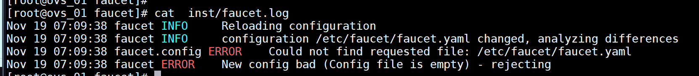
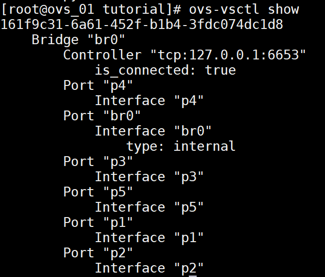
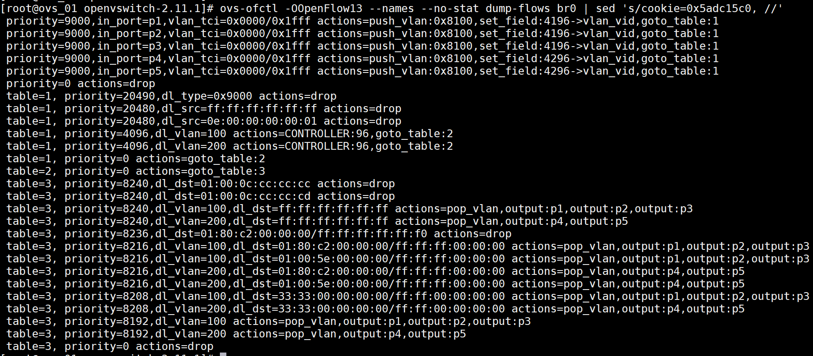
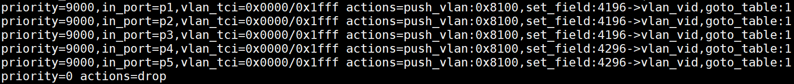

[TOC]


# OVS Faucet Tutorial

本教程演示Open vSwitch如何与通用OpenFlow控制器一起工作，这里以使用Faucet控制器作为示例。

OVS的安装见上一节。

沙盒的使用：

```shell
./boot.sh
./configure
make -j4
make sandbox
```

## Faucet安装

### 1 安装Docker

如已安装docker，可跳过这一步

```shell
yum install docker -y # 前置依赖
systemctl start docker
systemctl enable docker
```

### 2 获取源码

```shell
# 从github上获取源码，并进入到目录中，checkout到最新版本
git clone https://github.com/faucetsdn/faucet.git
cd faucet
latest_tag=$(git describe --tags $(git rev-list --tags --max-count=1))
git checkout $latest_tag
```



### 3 构建Docker镜像

```shell
cp Dockerfile.faucet Dockerfile
docker build -t faucet/faucet .
#  若出现报错：ERROR: http://dl-cdn.alpinelinux.org/alpine/v3.10/main: temporary error (try again later),请重启docker服务

# docker pull faucet/faucet:latest
```


### 4 创建Faucet容器

```shell
mkdir inst # 创建inst目录，该目录映射到容器里，作为容器里Faucet进程存放配置文件和日志的目录
docker run -d --name faucet --restart=always -v $(pwd)/inst/:/etc/faucet/ -v $(pwd)/inst/:/var/log/faucet/ -p 6653:6653 -p 9302:9302 faucet/faucet

# 查看日志，若出现类似以下日志，则表明容器已启动成功。日志中的报错是因为我们还没有写配置文件，可以暂时忽略
[root@ovs_01 faucet]# cat inst/faucet.log
Nov 19 07:09:38 faucet INFO     Reloading configuration
Nov 19 07:09:38 faucet INFO     configuration /etc/faucet/faucet.yaml changed, analyzing differences
Nov 19 07:09:38 faucet.config ERROR    Could not find requested file: /etc/faucet/faucet.yaml
Nov 19 07:09:38 faucet ERROR    New config bad (Config file is empty) - rejecting
```


## Overview

本教程接下来的工作：

1. Switching：使用Faucet设置一个L2网络
2. Routing：使用Faucet在多个L3网络之间路由
3. ACLs：增加和修改访问控制规则

从上到下，整个系统包含以下组件：

- Faucet：系统的顶层，是网络中所有配置的来源。可以通过**faucet.yaml**来配置网络，并通过**faucet.log**来观察状态，如MAC地址学习和ARP解析，还会提示我们配置是不是写错了。
- OVS中的OpenFlow子系统：OpenFlow是一个协议，想Faucet这样的控制器利用这个协议来控制OVS和其他交换机处理网络中的数据包的方式。我们会使用**ovs-ofctl**来观察和修改OpenFlow的行为。
- OVS数据通道：加速包处理的缓存设计。OVS有多个不同的数据通道，有基于内核的也有运行在用户空间的。OVS沙盒使用后者


### Switching

首先我们来设置一个带有VLAN的switch,来看看它在每一层是怎么工作的。编写下面配置，放到**inst/faucet.yaml**文件中：

```yaml
dps:
    switch-1:
        dp_id: 0x1
        timeout: 8000
        arp_neighbor_timeout: 3600
        interfaces:
            1:
                native_vlan: 100
            2:
                native_vlan: 100
            3:
                native_vlan: 100
            4:
                native_vlan: 200
            5:
                native_vlan: 200
vlans:
    100:
    200:
```

以上yaml文件定义了一个交换机switch-1，该交换机有5个端口，编号从1到5。端口1,2,3的VLAN号是100，4和5的VLAN号是200。Faucet可以通过switch的dp_id(datapath  id)来识别它，这这里dp_id设置为0x1。

执行命令`docker restart faucet`重启Faucet容器让上述配置生效。

使用`inst/faucet.log`查看日志，日志末尾可以看到类似以下输出：

```shell
Jan 06 15:14:35 faucet INFO     Add new datapath DPID 1 (0x1)
```

此时，Faucet正在等待datapath ID为0x1的交换机通过OpenFlow连上来。接下来我们就使用OVS创建一个switch并让它连上Faucet。

按照Setting up OVS中的步骤，使用`make sandbox`创建一个OVS。在沙盒中，我们使用如下命令创建一个br0网桥：

```shell
ovs-vsctl add-br br0 \
         -- set bridge br0 other-config:datapath-id=0000000000000001 \
         -- add-port br0 p1 -- set interface p1 ofport_request=1 \
         -- add-port br0 p2 -- set interface p2 ofport_request=2 \
         -- add-port br0 p3 -- set interface p3 ofport_request=3 \
         -- add-port br0 p4 -- set interface p4 ofport_request=4 \
         -- add-port br0 p5 -- set interface p5 ofport_request=5 \
         -- set-controller br0 tcp:127.0.0.1:6653 \
         -- set controller br0 connection-mode=out-of-band
```

上述命令中，datapath-id知道了该交换机的datapath ID为0x1，添加了p1到p5五个模拟交换机端口，并让它连接到Faucet控制器（控制器的地址：127.0.0.1:6653）

使用命令 `ovs-vsctl show`可以查看创建出来的网桥：



使用`inst/faucet.log`查看faucet日志，日志末尾可以看到类似以下输出：

```shell
[root@ovs_01 faucet]# cat inst/faucet.log
...
Nov 19 08:31:07 faucet.valve INFO     DPID 1 (0x1) switch-1 Cold start configuring DP
Nov 19 08:31:07 faucet.valve INFO     DPID 1 (0x1) switch-1 Configuring VLAN 100 vid:100 untagged: Port 1,Port 2,Port 3
Nov 19 08:31:07 faucet.valve INFO     DPID 1 (0x1) switch-1 Configuring VLAN 200 vid:200 untagged: Port 4,Port 5
```

说明Faucet控制器已经识别并配置好该交换机和它的端口。


查看OVS中的流表，大概长下面这样子：

```
[root@ovs_01 openvswitch-2.11.1]# ovs-ofctl -OOpenFlow13 --names --no-stat dump-flows br0 | sed 's/cookie=0x5adc15c0, //'
 priority=9000,in_port=p1,vlan_tci=0x0000/0x1fff actions=push_vlan:0x8100,set_field:4196->vlan_vid,goto_table:1
 priority=9000,in_port=p2,vlan_tci=0x0000/0x1fff actions=push_vlan:0x8100,set_field:4196->vlan_vid,goto_table:1
 priority=9000,in_port=p3,vlan_tci=0x0000/0x1fff actions=push_vlan:0x8100,set_field:4196->vlan_vid,goto_table:1
 priority=9000,in_port=p4,vlan_tci=0x0000/0x1fff actions=push_vlan:0x8100,set_field:4296->vlan_vid,goto_table:1
 priority=9000,in_port=p5,vlan_tci=0x0000/0x1fff actions=push_vlan:0x8100,set_field:4296->vlan_vid,goto_table:1
 priority=0 actions=drop
 table=1, priority=20490,dl_type=0x9000 actions=drop
 table=1, priority=20480,dl_src=ff:ff:ff:ff:ff:ff actions=drop
 table=1, priority=20480,dl_src=0e:00:00:00:00:01 actions=drop
 table=1, priority=4096,dl_vlan=100 actions=CONTROLLER:96,goto_table:2
 table=1, priority=4096,dl_vlan=200 actions=CONTROLLER:96,goto_table:2
 table=1, priority=0 actions=goto_table:2
 table=2, priority=0 actions=goto_table:3
 table=3, priority=8240,dl_dst=01:00:0c:cc:cc:cc actions=drop
 table=3, priority=8240,dl_dst=01:00:0c:cc:cc:cd actions=drop
 table=3, priority=8240,dl_vlan=100,dl_dst=ff:ff:ff:ff:ff:ff actions=pop_vlan,output:p1,output:p2,output:p3
 table=3, priority=8240,dl_vlan=200,dl_dst=ff:ff:ff:ff:ff:ff actions=pop_vlan,output:p4,output:p5
 table=3, priority=8236,dl_dst=01:80:c2:00:00:00/ff:ff:ff:ff:ff:f0 actions=drop
 table=3, priority=8216,dl_vlan=100,dl_dst=01:80:c2:00:00:00/ff:ff:ff:00:00:00 actions=pop_vlan,output:p1,output:p2,output:p3
 table=3, priority=8216,dl_vlan=100,dl_dst=01:00:5e:00:00:00/ff:ff:ff:00:00:00 actions=pop_vlan,output:p1,output:p2,output:p3
 table=3, priority=8216,dl_vlan=200,dl_dst=01:80:c2:00:00:00/ff:ff:ff:00:00:00 actions=pop_vlan,output:p4,output:p5
 table=3, priority=8216,dl_vlan=200,dl_dst=01:00:5e:00:00:00/ff:ff:ff:00:00:00 actions=pop_vlan,output:p4,output:p5
 table=3, priority=8208,dl_vlan=100,dl_dst=33:33:00:00:00:00/ff:ff:00:00:00:00 actions=pop_vlan,output:p1,output:p2,output:p3
 table=3, priority=8208,dl_vlan=200,dl_dst=33:33:00:00:00:00/ff:ff:00:00:00:00 actions=pop_vlan,output:p4,output:p5
 table=3, priority=8192,dl_vlan=100 actions=pop_vlan,output:p1,output:p2,output:p3
 table=3, priority=8192,dl_vlan=200 actions=pop_vlan,output:p4,output:p5
 table=3, priority=0 actions=drop

```



下面我们仔细分析下这些流表，先看table 0(table 0这里没有字段table=0):

```shell
 priority=9000,in_port=p1,vlan_tci=0x0000/0x1fff actions=push_vlan:0x8100,set_field:4196->vlan_vid,goto_table:1
 priority=9000,in_port=p2,vlan_tci=0x0000/0x1fff actions=push_vlan:0x8100,set_field:4196->vlan_vid,goto_table:1
 priority=9000,in_port=p3,vlan_tci=0x0000/0x1fff actions=push_vlan:0x8100,set_field:4196->vlan_vid,goto_table:1
 priority=9000,in_port=p4,vlan_tci=0x0000/0x1fff actions=push_vlan:0x8100,set_field:4296->vlan_vid,goto_table:1
 priority=9000,in_port=p5,vlan_tci=0x0000/0x1fff actions=push_vlan:0x8100,set_field:4296->vlan_vid,goto_table:1
 priority=0 actions=drop
```



table 0中，in_port字段表明接收p1~p5进来的网络包，vlan_tci=0x0000/0x1fff表明匹配的该包不带VLAN号。这里的actions操作是给该包加上vlan号，然后转到table 1去。4196=0x1064，而0x64=十进制100。最后一行，表示对齐所有已经带了VLAN或不在指定端口的包。

接下来我们看看table 1:

```shell
table=1, priority=20490,dl_type=0x9000 actions=drop
table=1, priority=20480,dl_src=ff:ff:ff:ff:ff:ff actions=drop
table=1, priority=20480,dl_src=0e:00:00:00:00:01 actions=drop
table=1, priority=4096,dl_vlan=100 actions=CONTROLLER:96,goto_table:2
table=1, priority=4096,dl_vlan=200 actions=CONTROLLER:96,goto_table:2
table=1, priority=0 actions=goto_table:2
```

table 1是用于MAC地址学习的，但这里控制器还没有学到什么地址，第2,3行表示丢弃广播包（为什么要丢弃广播包呢？？？）。


接下来是table 2:

```shell
table=2, priority=0 actions=goto_table:3
```

table 2什么也不做，只是简单地把包转发给table3。


使用以下命令查看一个网络包经过OVS时走的路径：

```shell
[root@ovs_01 openvswitch-2.11.1]# ovs-appctl ofproto/trace br0 in_port=p1
Flow: in_port=1,vlan_tci=0x0000,dl_src=00:00:00:00:00:00,dl_dst=00:00:00:00:00:00,dl_type=0x0000

bridge("br0")
-------------
 0. in_port=1,vlan_tci=0x0000/0x1fff, priority 9000, cookie 0x5adc15c0
    push_vlan:0x8100
    set_field:4196->vlan_vid
    goto_table:1
 1. dl_vlan=100, priority 4096, cookie 0x5adc15c0
    CONTROLLER:96
    goto_table:2
 2. priority 0, cookie 0x5adc15c0
    goto_table:3
 3. dl_vlan=100, priority 8192, cookie 0x5adc15c0
    pop_vlan
    output:1
     >> skipping output to input port
    output:2
    output:3

Final flow: unchanged
Megaflow: recirc_id=0,eth,in_port=1,vlan_tci=0x0000,dl_src=00:00:00:00:00:00,dl_dst=00:00:00:00:00:00,dl_type=0x0000
Datapath actions: push_vlan(vid=100,pcp=0),userspace(pid=0,controller(reason=1,dont_send=1,continuation=0,recirc_id=4,rule_cookie=0x5adc15c0,controller_id=0,max_len=96)),pop_vlan,2,3
```


第一行，是我们发出的请求的更详细的版本。

br0下面的几项，表示每个网络包经过表x时，发生的操作。例如在表0中，网络包会被加上vlan id 100，并继续交给表1。表1将包发送给控制器，来允许Mac学习。表3把网络包广播给通个VLAN下的网络端口（2,3）

流表信息后面是概要信息，unchanged表示该包没有被修改（虽然表0给它加了vlan，但表3又把它去掉了）。Datapath actions表示这个网络包被应用了什么操作。

表1把包发给控制器触发了MAC学习。这是因为第一次接收到该mac地址的包，第二次接收到的时候就不会触发了。


### 触发MAC地址学习

保持当前流表到flows1中,以便后面进行对比：

```shell
ovs-ofctl -OOpenFlow13 --no-names --sort dump-flows "$@" br0  > flows1
```

发送一个带源mac地址和目的mac地址的包：

```shell
[root@ovs_01 openvswitch-2.11.1]# ovs-appctl ofproto/trace br0 in_port=p1,dl_src=00:11:11:00:00:00,dl_dst=00:22:22:00:00:00 -generate
Flow: in_port=1,vlan_tci=0x0000,dl_src=00:11:11:00:00:00,dl_dst=00:22:22:00:00:00,dl_type=0x0000

bridge("br0")
-------------
 0. in_port=1,vlan_tci=0x0000/0x1fff, priority 9000, cookie 0x5adc15c0
    push_vlan:0x8100
    set_field:4196->vlan_vid
    goto_table:1
 1. dl_vlan=100, priority 4096, cookie 0x5adc15c0
    CONTROLLER:96
    goto_table:2
 2. priority 0, cookie 0x5adc15c0
    goto_table:3
 3. dl_vlan=100, priority 8192, cookie 0x5adc15c0
    pop_vlan
    output:1
     >> skipping output to input port
    output:2
    output:3

Final flow: unchanged
Megaflow: recirc_id=0,eth,in_port=1,vlan_tci=0x0000,dl_src=00:11:11:00:00:00,dl_dst=00:22:22:00:00:00,dl_type=0x0000
Datapath actions: push_vlan(vid=100,pcp=0),userspace(pid=0,controller(reason=1,dont_send=0,continuation=0,recirc_id=9,rule_cookie=0x5adc15c0,controller_id=0,max_len=96)),pop_vlan,2,3

```

查看日志：

```shell
[root@ovs_01 faucet]# cat inst/faucet.log
... 
Nov 20 11:30:43 faucet.valve INFO     DPID 1 (0x1) switch-1 L2 learned on Port 1 00:11:11:00:00:00 (L2 type 0x0000, L2 dst 00:22:22:00:00:00, L3 src None, L3 dst None) Port 1 VLAN 100 (1 hosts total)
```

我们可以看到控制器已经学习得到port 1端口的mac地址为：00:11:11:00:00:00。

查看流表变化：

```shell
[root@ovs_01 openvswitch-2.11.1]# ovs-ofctl -OOpenFlow13 diff-flows "$@" flows1 br0 | sed 's/cookie=0x5adc15c0 //'
+table=1 priority=8191,in_port=1,dl_vlan=100,dl_src=00:11:11:00:00:00 hard_timeout=7922 actions=goto_table:2
+table=2 priority=8192,dl_vlan=100,dl_dst=00:11:11:00:00:00 idle_timeout=11922 actions=pop_vlan,output:1
```

我们可以看到流表中多了两条和学到的mac相关的流。

接下来我们看看学到的MAC地址有什么用，我们从另一个端口p2向上述学习得到的mac地址发送数据包，

```shell
[root@ovs_01 openvswitch-2.11.1]# ovs-appctl ofproto/trace br0 in_port=p2,dl_src=00:22:22:00:00:00,dl_dst=00:11:11:00:00:00 -generate
Flow: in_port=2,vlan_tci=0x0000,dl_src=00:22:22:00:00:00,dl_dst=00:11:11:00:00:00,dl_type=0x0000

bridge("br0")
-------------
 0. in_port=2,vlan_tci=0x0000/0x1fff, priority 9000, cookie 0x5adc15c0
    push_vlan:0x8100
    set_field:4196->vlan_vid
    goto_table:1
 1. dl_vlan=100, priority 4096, cookie 0x5adc15c0
    CONTROLLER:96
    goto_table:2
 2. dl_vlan=100,dl_dst=00:11:11:00:00:00, priority 8192, cookie 0x5adc15c0
    pop_vlan
    output:1

Final flow: unchanged
Megaflow: recirc_id=0,eth,in_port=2,vlan_tci=0x0000,dl_src=00:22:22:00:00:00,dl_dst=00:11:11:00:00:00,dl_type=0x0000
Datapath actions: push_vlan(vid=100,pcp=0),userspace(pid=0,controller(reason=1,dont_send=0,continuation=0,recirc_id=10,rule_cookie=0x5adc15c0,controller_id=0,max_len=96)),pop_vlan,1
```

从输出我们可以知道，该包也被发送到了控制器去了，查看一下日志就可以发现,p2的mac地址也被控制器学习了：

```shell
Nov 20 11:30:43 faucet.valve INFO     DPID 1 (0x1) switch-1 L2 learned on Port 1 00:11:11:00:00:00 (L2 type 0x0000, L2 dst 00:22:22:00:00:00, L3 src None, L3 dst None) Port 1 VLAN 100 (1 hosts total)
Nov 20 11:45:17 faucet.valve INFO     DPID 1 (0x1) switch-1 L2 learned on Port 2 00:22:22:00:00:00 (L2 type 0x0000, L2 dst 00:11:11:00:00:00, L3 src None, L3 dst None) Port 2 VLAN 100 (2 hosts total)
```

这时候我们再一次从p2向第一次学习到的mac地址发包：

```shell
[root@ovs_01 openvswitch-2.11.1]# ovs-appctl ofproto/trace br0 in_port=p2,dl_src=00:22:22:00:00:00,dl_dst=00:11:11:00:00:00 -generate
Flow: in_port=2,vlan_tci=0x0000,dl_src=00:22:22:00:00:00,dl_dst=00:11:11:00:00:00,dl_type=0x0000

bridge("br0")
-------------
 0. in_port=2,vlan_tci=0x0000/0x1fff, priority 9000, cookie 0x5adc15c0
    push_vlan:0x8100
    set_field:4196->vlan_vid
    goto_table:1
 1. in_port=2,dl_vlan=100,dl_src=00:22:22:00:00:00, priority 8191, cookie 0x5adc15c0
    goto_table:2
 2. dl_vlan=100,dl_dst=00:11:11:00:00:00, priority 8192, cookie 0x5adc15c0
    pop_vlan
    output:1

Final flow: unchanged
Megaflow: recirc_id=0,eth,in_port=2,vlan_tci=0x0000/0x1fff,dl_src=00:22:22:00:00:00,dl_dst=00:11:11:00:00:00,dl_type=0x0000
Datapath actions: 1
```

我们可以看到，这一次不需要再把包发到控制器那里，因为OVS在table 1和table 2中已经缓存了该MAC地址。


## 性能


OVS的代码分为两个主要的组件：slow path和fast path。

1. slow path嵌入到用户空间程序ovs-vswitchd中。它的任务是拿到一个包，并遍历OpenFlow表来决定要怎么处理这个包，它的输出是一个action列表，格式类似于OpenFlow的action但更简单一些，一般称为"ODP actions"或者“datapath actions"，之后它会把这些action发送到datapath，datapath会执行这些action。
2. fastpath即datapath。

OVS有一条slow path和多条fast path。OVS的Linux内核模式和DPDK不同的部分是datapath。

所有CFM, BFD, LACP, STP, and LLDP协议的处理都是在慢通道里处理的，OVS自己处理这些协议而不是委托给控制器下发的流。修改ARP字段的流也都在OVS的慢通道里处理。这些情况不太可能导致性能问题，因为这些协议发送包的速率很低。

OVS有多级缓存：

1. 一个包首先会到达datapath。一些datapath（如DPDK和in-tree版本的OVS内核模块）有一个一级Cache叫“microflow cache”，这个cache对相对长周期，高频率的流的性能影响至关重要。如果datapath有一个microflow cache，便会先去cache里面查，cache命中的话便会执行和该cache相关联的actions。否则进入步骤2.
2. 二级cache叫“megaflow cache”，megaflow cache对短生命周期，低频率的流影响比较大。如果megaflow cache能命中，便执行相关的actions，否则进入步骤3。
3. datapath把包发给slow path，在slow path中遍历OpenFlow表并产生ODP actions，这个过程通常被称为“flow translation”。然后把包发回datapath执行这些action，在某些情况下，还会把这些actions写到megaflow cache里，这样后面的包就不需要再经过slow path了（虽然大多数情况下是不会进行缓存的？？？？？）。

megaflow cache是性能调优的关键cache。OVS提供了理解和优化其行为的工具，**ofproto/trace**就是最常用的工具之一,我们再来看看前面执行这个命令的输出：

```shell
[root@ovs_01 openvswitch-2.11.1]# ovs-appctl ofproto/trace br0 in_port=p2,dl_src=00:22:22:00:00:00,dl_dst=00:11:11:00:00:00 -generate
Flow: in_port=2,vlan_tci=0x0000,dl_src=00:22:22:00:00:00,dl_dst=00:11:11:00:00:00,dl_type=0x0000

bridge("br0")
-------------
 0. in_port=2,vlan_tci=0x0000/0x1fff, priority 9000, cookie 0x5adc15c0
    push_vlan:0x8100
    set_field:4196->vlan_vid
    goto_table:1
 1. in_port=2,dl_vlan=100,dl_src=00:22:22:00:00:00, priority 8191, cookie 0x5adc15c0
    goto_table:2
 2. dl_vlan=100,dl_dst=00:11:11:00:00:00, priority 8192, cookie 0x5adc15c0
    pop_vlan
    output:1

Final flow: unchanged
Megaflow: recirc_id=0,eth,in_port=2,vlan_tci=0x0000/0x1fff,dl_src=00:22:22:00:00:00,dl_dst=00:11:11:00:00:00,dl_type=0x0000
Datapath actions: 1
```

该命令的输出的megaflow项就是OVS将要插入megaflow表的表项，几个字段的意义如下：

- **recirc_id**：这个是实现上的细节，用户不需要知道
- **eth**：表明这个cache项只匹配以太网包

有一点需要注意的，为什么dl_type会是0x000呢？原因之一是，该流在表1中的优先级不如下面的流优先级高：

```shell
duration=5121.533s, table=1, n_packets=0, n_bytes=0, priority=20490,dl_type=0x9000 actions=drop
```

所有`ovs-vswitchd` 不得不添加一个dl_type项来保证不会被匹配到上面这个流。

当一个megaflow流匹配的字段越多，能匹配到的包就越少，从缓存的角度来看它的价值就越低。 如果一个megaflow匹配了L2,L3的地址和L4的端口信息，那么就只有一个流（连接）能匹配到它了，假设该连接和大多数连接一样，只有几个包，那么慢通道处理的高昂开销平摊下来就会很高。

关于OVS如何构建megaflow，详见论文《The Design and Implementation of Open vSwitch》

## Routing

修改配置文件**inst/faucet.yaml**，以启用Routing：

```yaml
dps:
    switch-1:
        dp_id: 0x1
        timeout: 8000
        arp_neighbor_timeout: 3600
        interfaces:
            1:
                native_vlan: 100
            2:
                native_vlan: 100
            3:
                native_vlan: 100
            4:
                native_vlan: 200
            5:
                native_vlan: 200
vlans:
    100:
        faucet_vips: ["10.100.0.254/24"]
    200:
        faucet_vips: ["10.200.0.254/24"]
routers:
    router-1:
        vlans: [100, 200]
```

修改以后需要重启一下：

```shell
docker restart faucet
```

可以看一下和之前L2的网络的流表的对比：

```shell
[root@ovs_01 openvswitch-2.11.1]# ovs-ofctl -OOpenFlow13 diff-flows "$@" flows0 br0 | sed 's/cookie=0x5adc15c0,//'
+table=1 priority=16384,arp,dl_vlan=100 cookie=0x5adc15c0 actions=goto_table:3
+table=1 priority=16384,arp,dl_vlan=200 cookie=0x5adc15c0 actions=goto_table:3
+table=1 priority=16384,ip,dl_vlan=100,dl_dst=0e:00:00:00:00:01 cookie=0x5adc15c0 actions=goto_table:2
+table=1 priority=16384,ip,dl_vlan=200,dl_dst=0e:00:00:00:00:01 cookie=0x5adc15c0 actions=goto_table:2
-table=1 priority=4096,dl_vlan=100 cookie=0x5adc15c0 actions=CONTROLLER:96,goto_table:2
+table=1 priority=4096,dl_vlan=100 cookie=0x5adc15c0 actions=CONTROLLER:96,goto_table:4
-table=1 priority=4096,dl_vlan=200 cookie=0x5adc15c0 actions=CONTROLLER:96,goto_table:2
+table=1 priority=4096,dl_vlan=200 cookie=0x5adc15c0 actions=CONTROLLER:96,goto_table:4
-table=1 priority=0 cookie=0x5adc15c0 actions=goto_table:2
+table=1 priority=0 cookie=0x5adc15c0 actions=goto_table:4
+table=2 priority=12320,ip,dl_vlan=100,nw_dst=10.100.0.254 cookie=0x5adc15c0 actions=goto_table:3
+table=2 priority=12320,ip,dl_vlan=200,nw_dst=10.200.0.254 cookie=0x5adc15c0 actions=goto_table:3
+table=2 priority=12312,ip,dl_vlan=200,nw_dst=10.100.0.0/24 cookie=0x5adc15c0 actions=goto_table:3
+table=2 priority=12312,ip,dl_vlan=100,nw_dst=10.100.0.0/24 cookie=0x5adc15c0 actions=goto_table:3
+table=2 priority=12312,ip,dl_vlan=200,nw_dst=10.200.0.0/24 cookie=0x5adc15c0 actions=goto_table:3
+table=2 priority=12312,ip,dl_vlan=100,nw_dst=10.200.0.0/24 cookie=0x5adc15c0 actions=goto_table:3
-table=2 priority=0 cookie=0x5adc15c0 actions=goto_table:3
+table=2 priority=0 cookie=0x5adc15c0 actions=drop
+table=3 priority=12320,arp,dl_dst=ff:ff:ff:ff:ff:ff,arp_tpa=10.100.0.254 cookie=0x5adc15c0 actions=CONTROLLER:64
+table=3 priority=12320,arp,dl_dst=ff:ff:ff:ff:ff:ff,arp_tpa=10.200.0.254 cookie=0x5adc15c0 actions=CONTROLLER:64
+table=3 priority=12320,arp,dl_dst=0e:00:00:00:00:01 cookie=0x5adc15c0 actions=CONTROLLER:64
+table=3 priority=12317,ip,dl_dst=0e:00:00:00:00:01 cookie=0x5adc15c0 actions=CONTROLLER:194
+table=3 priority=12319,arp cookie=0x5adc15c0 actions=goto_table:4
+table=3 priority=12316,ip cookie=0x5adc15c0 actions=CONTROLLER:194,goto_table:4
+table=3 priority=12319,icmp,dl_dst=0e:00:00:00:00:01 cookie=0x5adc15c0 actions=CONTROLLER:174
+table=3 priority=12318,icmp cookie=0x5adc15c0 actions=CONTROLLER:194,goto_table:4
-table=3 priority=8240,dl_dst=01:00:0c:cc:cc:cc cookie=0x5adc15c0 actions=drop
-table=3 priority=8240,dl_dst=01:00:0c:cc:cc:cd cookie=0x5adc15c0 actions=drop
-table=3 priority=8240,dl_vlan=100,dl_dst=ff:ff:ff:ff:ff:ff cookie=0x5adc15c0 actions=pop_vlan,output:1,output:2,output:3
-table=3 priority=8240,dl_vlan=200,dl_dst=ff:ff:ff:ff:ff:ff cookie=0x5adc15c0 actions=pop_vlan,output:4,output:5
-table=3 priority=8236,dl_dst=01:80:c2:00:00:00/ff:ff:ff:ff:ff:f0 cookie=0x5adc15c0 actions=drop
-table=3 priority=8216,dl_vlan=100,dl_dst=01:80:c2:00:00:00/ff:ff:ff:00:00:00 cookie=0x5adc15c0 actions=pop_vlan,output:1,output:2,output:3
-table=3 priority=8216,dl_vlan=100,dl_dst=01:00:5e:00:00:00/ff:ff:ff:00:00:00 cookie=0x5adc15c0 actions=pop_vlan,output:1,output:2,output:3
-table=3 priority=8216,dl_vlan=200,dl_dst=01:80:c2:00:00:00/ff:ff:ff:00:00:00 cookie=0x5adc15c0 actions=pop_vlan,output:4,output:5
-table=3 priority=8216,dl_vlan=200,dl_dst=01:00:5e:00:00:00/ff:ff:ff:00:00:00 cookie=0x5adc15c0 actions=pop_vlan,output:4,output:5
-table=3 priority=8208,dl_vlan=100,dl_dst=33:33:00:00:00:00/ff:ff:00:00:00:00 cookie=0x5adc15c0 actions=pop_vlan,output:1,output:2,output:3
-table=3 priority=8208,dl_vlan=200,dl_dst=33:33:00:00:00:00/ff:ff:00:00:00:00 cookie=0x5adc15c0 actions=pop_vlan,output:4,output:5
-table=3 priority=8192,dl_vlan=100 cookie=0x5adc15c0 actions=pop_vlan,output:1,output:2,output:3
-table=3 priority=8192,dl_vlan=200 cookie=0x5adc15c0 actions=pop_vlan,output:4,output:5
+table=4 priority=0 cookie=0x5adc15c0 actions=goto_table:5
+table=5 priority=8240,dl_dst=01:00:0c:cc:cc:cc cookie=0x5adc15c0 actions=drop
+table=5 priority=8240,dl_dst=01:00:0c:cc:cc:cd cookie=0x5adc15c0 actions=drop
+table=5 priority=8240,dl_vlan=100,dl_dst=ff:ff:ff:ff:ff:ff cookie=0x5adc15c0 actions=pop_vlan,output:1,output:2,output:3
+table=5 priority=8240,dl_vlan=200,dl_dst=ff:ff:ff:ff:ff:ff cookie=0x5adc15c0 actions=pop_vlan,output:4,output:5
+table=5 priority=8236,dl_dst=01:80:c2:00:00:00/ff:ff:ff:ff:ff:f0 cookie=0x5adc15c0 actions=drop
+table=5 priority=8216,dl_vlan=100,dl_dst=01:80:c2:00:00:00/ff:ff:ff:00:00:00 cookie=0x5adc15c0 actions=pop_vlan,output:1,output:2,output:3
+table=5 priority=8216,dl_vlan=100,dl_dst=01:00:5e:00:00:00/ff:ff:ff:00:00:00 cookie=0x5adc15c0 actions=pop_vlan,output:1,output:2,output:3
+table=5 priority=8216,dl_vlan=200,dl_dst=01:80:c2:00:00:00/ff:ff:ff:00:00:00 cookie=0x5adc15c0 actions=pop_vlan,output:4,output:5
+table=5 priority=8216,dl_vlan=200,dl_dst=01:00:5e:00:00:00/ff:ff:ff:00:00:00 cookie=0x5adc15c0 actions=pop_vlan,output:4,output:5
+table=5 priority=8208,dl_vlan=100,dl_dst=33:33:00:00:00:00/ff:ff:00:00:00:00 cookie=0x5adc15c0 actions=pop_vlan,output:1,output:2,output:3
+table=5 priority=8208,dl_vlan=200,dl_dst=33:33:00:00:00:00/ff:ff:00:00:00:00 cookie=0x5adc15c0 actions=pop_vlan,output:4,output:5
+table=5 priority=8192,dl_vlan=100 cookie=0x5adc15c0 actions=pop_vlan,output:1,output:2,output:3
+table=5 priority=8192,dl_vlan=200 cookie=0x5adc15c0 actions=pop_vlan,output:4,output:5
+table=5 priority=0 cookie=0x5adc15c0 actions=drop

```

我们先看看表1：

```shell
[root@ovs_01 openvswitch-2.11.1]# ovs-ofctl -OOpenFlow13 diff-flows "$@" flows0 br0 | sed 's/cookie=0x5adc15c0//'|grep 'table=1'
+table=1 priority=16384,arp,dl_vlan=100  actions=goto_table:3
+table=1 priority=16384,arp,dl_vlan=200  actions=goto_table:3
+table=1 priority=16384,ip,dl_vlan=100,dl_dst=0e:00:00:00:00:01  actions=goto_table:2
+table=1 priority=16384,ip,dl_vlan=200,dl_dst=0e:00:00:00:00:01  actions=goto_table:2
-table=1 priority=4096,dl_vlan=100  actions=CONTROLLER:96,goto_table:2
+table=1 priority=4096,dl_vlan=100  actions=CONTROLLER:96,goto_table:4
-table=1 priority=4096,dl_vlan=200  actions=CONTROLLER:96,goto_table:2
+table=1 priority=4096,dl_vlan=200  actions=CONTROLLER:96,goto_table:4
-table=1 priority=0  actions=goto_table:2
+table=1 priority=0  actions=goto_table:4
```

表1增加了将arp包导向表3的流表项，这个表项应该是去处理router ip的arp。同时也增加了转发IP包到表2的流表项。

表2(IPV4_FIB Table)：

```shell
[root@ovs_01 openvswitch-2.11.1]# ovs-ofctl -OOpenFlow13 diff-flows "$@" flows0 br0 | sed 's/cookie=0x5adc15c0//'|grep 'table=2'
+table=2 priority=12320,ip,dl_vlan=100,nw_dst=10.100.0.254  actions=goto_table:3
+table=2 priority=12320,ip,dl_vlan=200,nw_dst=10.200.0.254  actions=goto_table:3
+table=2 priority=12312,ip,dl_vlan=200,nw_dst=10.100.0.0/24  actions=goto_table:3
+table=2 priority=12312,ip,dl_vlan=100,nw_dst=10.100.0.0/24  actions=goto_table:3
+table=2 priority=12312,ip,dl_vlan=200,nw_dst=10.200.0.0/24  actions=goto_table:3
+table=2 priority=12312,ip,dl_vlan=100,nw_dst=10.200.0.0/24  actions=goto_table:3
-table=2 priority=0  actions=goto_table:3
+table=2 priority=0  actions=drop
```

只转发10.200.0.0/24和10.100.0.0/24网段的包。

表3(VIP Table)：

```sh
[root@ovs_01 openvswitch-2.11.1]# ovs-ofctl -OOpenFlow13 diff-flows "$@" flows0 br0 | sed 's/cookie=0x5adc15c0//'|grep 'table=3'
+table=3 priority=12320,arp,dl_dst=ff:ff:ff:ff:ff:ff,arp_tpa=10.100.0.254  actions=CONTROLLER:64
+table=3 priority=12320,arp,dl_dst=ff:ff:ff:ff:ff:ff,arp_tpa=10.200.0.254  actions=CONTROLLER:64
+table=3 priority=12320,arp,dl_dst=0e:00:00:00:00:01  actions=CONTROLLER:64
+table=3 priority=12317,ip,dl_dst=0e:00:00:00:00:01  actions=CONTROLLER:194
+table=3 priority=12319,arp  actions=goto_table:4
+table=3 priority=12316,ip  actions=CONTROLLER:194,goto_table:4
+table=3 priority=12319,icmp,dl_dst=0e:00:00:00:00:01  actions=CONTROLLER:174
+table=3 priority=12318,icmp  actions=CONTROLLER:194,goto_table:4
```

第1和第2行表示发送router IP的arp请求给控制器。

### Tracing

如果所有需要转发的包都需要经过控制器的话，那性能就太差了。当然不可能是这样，按道理说只要有第一次包经过处理后相关流表项就会被缓存下来，所有我们来尝试触发一下这些流程，我们先把当前流表保存一下以便后面做比较：

```shell
[root@ovs_01 openvswitch-2.11.1]# ovs-ofctl -OOpenFlow13 --no-names --sort dump-flows "$@" br0  > flows2
```

假设p1端口的机器IP为10.100.0.1，p4端口的IP地址10.200.0.1，我们进行一下模拟：

#### 第1步 Host ARP for Router

我们模拟一个从10.100.0.1发出的arp请求给它的路由器10.100.0.254。执行以下命令：

```shell
[root@ovs_01 openvswitch-2.11.1]# ovs-appctl ofproto/trace br0 in_port=p1,dl_src=00:01:02:03:04:05,dl_dst=ff:ff:ff:ff:ff:ff,dl_type=0x806,arp_spa=10.100.0.1,arp_tpa=10.100.0.254,arp_sha=00:01:02:03:04:05,arp_tha=ff:ff:ff:ff:ff:ff,arp_op=1 -generate
Flow: arp,in_port=1,vlan_tci=0x0000,dl_src=00:01:02:03:04:05,dl_dst=ff:ff:ff:ff:ff:ff,arp_spa=10.100.0.1,arp_tpa=10.100.0.254,arp_op=1,arp_sha=00:01:02:03:04:05,arp_tha=ff:ff:ff:ff:ff:ff

bridge("br0")
-------------
 0. in_port=1,vlan_tci=0x0000/0x1fff, priority 9000, cookie 0x5adc15c0
    push_vlan:0x8100
    set_field:4196->vlan_vid
    goto_table:1
 1. arp,dl_vlan=100, priority 16384, cookie 0x5adc15c0
    goto_table:3
 3. arp,dl_dst=ff:ff:ff:ff:ff:ff,arp_tpa=10.100.0.254, priority 12320, cookie 0x5adc15c0
    CONTROLLER:64

Final flow: arp,in_port=1,dl_vlan=100,dl_vlan_pcp=0,vlan_tci1=0x0000,dl_src=00:01:02:03:04:05,dl_dst=ff:ff:ff:ff:ff:ff,arp_spa=10.100.0.1,arp_tpa=10.100.0.254,arp_op=1,arp_sha=00:01:02:03:04:05,arp_tha=ff:ff:ff:ff:ff:ff
Megaflow: recirc_id=0,eth,arp,in_port=1,vlan_tci=0x0000/0x1fff,dl_src=00:01:02:03:04:05,dl_dst=ff:ff:ff:ff:ff:ff,arp_tpa=10.100.0.254
Datapath actions: push_vlan(vid=100,pcp=0),userspace(pid=0,controller(reason=1,dont_send=0,continuation=0,recirc_id=11,rule_cookie=0x5adc15c0,controller_id=0,max_len=64))
```

命令执行后的output表明该包被当做一个arp包处理，并发给了控制器(table 3)，我们再看一下Faucet控制器的日志：

```shell
[root@ovs_01 faucet]# cat inst/faucet.log
...
Nov 21 08:10:57 faucet.valve INFO     DPID 1 (0x1) switch-1 L2 learned on Port 1 00:01:02:03:04:05 (L2 type 0x0806, L2 dst ff:ff:ff:ff:ff:ff, L3 src 10.100.0.1, L3 dst 10.100.0.254) Port 1 VLAN 100 (1 hosts total)
Nov 21 08:10:57 faucet.valve INFO     DPID 1 (0x1) switch-1 Adding new route 10.100.0.1/32 via 10.100.0.1 (00:01:02:03:04:05) on VLAN 100
Nov 21 08:10:57 faucet.valve INFO     DPID 1 (0x1) switch-1 Resolve response to 10.100.0.254 from 00:01:02:03:04:05 (L2 type 0x0806, L2 dst ff:ff:ff:ff:ff:ff, L3 src 10.100.0.1, L3 dst 10.100.0.254) Port 1 VLAN 100

```

可以看到，第1行，表明控制器学习到了port 1主机10.100.0.1的mac地址；第2行，表明控制器学习到了主机和其mac地址的映射关系；我们继续看看OVS上的流表变化：

```shell
[root@ovs_01 openvswitch-2.11.1]# ovs-ofctl -OOpenFlow13 diff-flows "$@" flows2 br0 | sed 's/cookie=0x5adc15c0//'
+table=1 priority=8191,in_port=1,dl_vlan=100,dl_src=00:01:02:03:04:05  hard_timeout=7946 actions=goto_table:4
+table=2 priority=12320,ip,dl_vlan=200,nw_dst=10.100.0.1  actions=set_field:4196->vlan_vid,set_field:0e:00:00:00:00:01->eth_src,set_field:00:01:02:03:04:05->eth_dst,dec_ttl,goto_table:4
+table=2 priority=12320,ip,dl_vlan=100,nw_dst=10.100.0.1  actions=set_field:4196->vlan_vid,set_field:0e:00:00:00:00:01->eth_src,set_field:00:01:02:03:04:05->eth_dst,dec_ttl,goto_table:4
+table=4 priority=8192,dl_vlan=100,dl_dst=00:01:02:03:04:05  idle_timeout=11946 actions=pop_vlan,output:1
```

第1行和第4行记录了学习到的mac地址；第2和第3行表示把目的地址为10.100.0.1的包转发到相应的mac地址。


#### 第2步 Router Sends ARP Reply

faucet.log里面我们可以看到faucet发送了一个arp响应。但是模拟的包默认会被丢弃，我们可以配置模拟端口把手动的包保存到文件中：

```shell
ovs-vsctl set interface p1 options:pcap=p1.pcap
```

然后我们再个控制器发送arp请求：

```shell
ovs-appctl ofproto/trace br0 in_port=p1,dl_src=00:01:02:03:04:05,dl_dst=ff:ff:ff:ff:ff:ff,dl_type=0x806,arp_spa=10.100.0.1,arp_tpa=10.100.0.254,arp_sha=00:01:02:03:04:05,arp_tha=ff:ff:ff:ff:ff:ff,arp_op=1 -generate

# 查看arp响应包
[root@ovs_01 tutorial]# tcpdump -evvvr sandbox/p1.pcap
reading from file sandbox/p1.pcap, link-type EN10MB (Ethernet)
17:50:25.439480 0e:00:00:00:00:01 (oui Unknown) > 00:01:02:03:04:05 (oui Unknown), ethertype ARP (0x0806), length 60: Ethernet (len 6), IPv4 (len 4), Reply 10.100.0.254 is-at 0e:00:00:00:00:01 (oui Unknown), length 46
```

从arp reply我们可以看出Faucet Router的mac地址是0e:00:00:00:00:01。

为了后续实验方便，我们把所有端口收到的包都保存到文件中：

```shell
for i in 2 3 4 5; do ovs-vsctl set interface p$i options:pcap=p$i.pcap; done
```


#### 第3步 Host Sends IP Packet

经过上面步骤，p1的主机已经知道其路由器的mac地址了，接下来我们可以模拟主机通过router mac发送一个包给10.200.0.1，如下所示：

```shell
[root@ovs_01 tutorial]# ovs-appctl ofproto/trace br0 in_port=p1,dl_src=00:01:02:03:04:05,dl_dst=0e:00:00:00:00:01,udp,nw_src=10.100.0.1,nw_dst=10.200.0.1,nw_ttl=64 -generate

bridge("br0")
-------------
 0. in_port=1,vlan_tci=0x0000/0x1fff, priority 9000, cookie 0x5adc15c0
    push_vlan:0x8100
    set_field:4196->vlan_vid
    goto_table:1
 1. ip,dl_vlan=100,dl_dst=0e:00:00:00:00:01, priority 16384, cookie 0x5adc15c0
    goto_table:2
 2. ip,dl_vlan=100,nw_dst=10.200.0.0/24, priority 12312, cookie 0x5adc15c0
    goto_table:3
 3. ip,dl_dst=0e:00:00:00:00:01, priority 12317, cookie 0x5adc15c0
    CONTROLLER:194

Final flow: udp,in_port=1,dl_vlan=100,dl_vlan_pcp=0,vlan_tci1=0x0000,dl_src=00:01:02:03:04:05,dl_dst=0e:00:00:00:00:01,nw_src=10.100.0.1,nw_dst=10.200.0.1,nw_tos=0,nw_ecn=0,nw_ttl=64,tp_src=0,tp_dst=0
Megaflow: recirc_id=0,eth,udp,in_port=1,vlan_tci=0x0000/0x1fff,dl_src=00:01:02:03:04:05,dl_dst=0e:00:00:00:00:01,nw_dst=10.200.0.0/25,nw_frag=no
Datapath actions: push_vlan(vid=100,pcp=0),userspace(pid=0,controller(reason=1,dont_send=0,continuation=0,recirc_id=6,rule_cookie=0x5adc15c0,controller_id=0,max_len=194))
```

从输出我们可以看到，table 1识别出了目的mac为router的mac的流，转发给了table 2，在最后，table 3又把包转给了控制器，这是因为控制器还没有解析得到10.200.0.1的mac地址，此时需要一个arp请求来获取10.200.0.1的mac地址，我们继续下一步。

#### 步骤4 Router Broadcasts ARP Request

路由器要怎么知道10.200.0.1的mac地址呢？它会向p4和p5发送arp广播，因为这两个端口的vlan是200的（配置文件中配置的）。所以我们来看看这两个端口有没有收到arp请求：

```shell
[root@ovs_01 tutorial]# tcpdump -evvvr sandbox/p4.pcap
reading from file sandbox/p4.pcap, link-type EN10MB (Ethernet)
17:57:59.399891 0e:00:00:00:00:01 (oui Unknown) > Broadcast, ethertype ARP (0x0806), length 60: Ethernet (len 6), IPv4 (len 4), Request who-has 10.200.0.1 tell 10.200.0.254, length 46

[root@ovs_01 tutorial]# tcpdump -evvvr sandbox/p5.pcap
reading from file sandbox/p5.pcap, link-type EN10MB (Ethernet)
17:57:59.399909 0e:00:00:00:00:01 (oui Unknown) > Broadcast, ethertype ARP (0x0806), length 60: Ethernet (len 6), IPv4 (len 4), Request who-has 10.200.0.1 tell 10.200.0.254, length 46
```

从上面我们可以看到这两个端口确实是收到来自router的arp请求，我们也可以检查一下p3端口，会发现这个端口就没有收到arp请求。


#### 步骤5 Host 2 Sends ARP Reply

Faucet控制器发送了一个ARP请求，那么我们就要给它一个arp响应，如下：

```shell
[root@ovs_01 tutorial]# ovs-appctl ofproto/trace br0 in_port=p4,dl_src=00:10:20:30:40:50,dl_dst=0e:00:00:00:00:01,dl_type=0x806,arp_spa=10.200.0.1,arp_tpa=10.200.0.254,arp_sha=00:10:20:30:40:50,arp_tha=0e:00:00:00:00:01,arp_op=2 -generate

bridge("br0")
-------------
 0. in_port=4,vlan_tci=0x0000/0x1fff, priority 9000, cookie 0x5adc15c0
    push_vlan:0x8100
    set_field:4296->vlan_vid
    goto_table:1
 1. arp,dl_vlan=200, priority 16384, cookie 0x5adc15c0
    goto_table:3
 3. arp,dl_dst=0e:00:00:00:00:01, priority 12320, cookie 0x5adc15c0
    CONTROLLER:64

Final flow: arp,in_port=4,dl_vlan=200,dl_vlan_pcp=0,vlan_tci1=0x0000,dl_src=00:10:20:30:40:50,dl_dst=0e:00:00:00:00:01,arp_spa=10.200.0.1,arp_tpa=10.200.0.254,arp_op=2,arp_sha=00:10:20:30:40:50,arp_tha=0e:00:00:00:00:01
Megaflow: recirc_id=0,eth,arp,in_port=4,vlan_tci=0x0000/0x1fff,dl_src=00:10:20:30:40:50,dl_dst=0e:00:00:00:00:01
Datapath actions: push_vlan(vid=200,pcp=0),userspace(pid=0,controller(reason=1,dont_send=0,continuation=0,recirc_id=7,rule_cookie=0x5adc15c0,controller_id=0,max_len=64))
```

查看faucet的日志：

```shell
[root@ovs_01 faucet]# cat inst/faucet.log
...
Nov 21 10:23:44 faucet.valve INFO     DPID 1 (0x1) switch-1 L2 learned on Port 4 00:10:20:30:40:50 (L2 type 0x0806, L2 dst 0e:00:00:00:00:01, L3 src 10.200.0.1, L3 dst 10.200.0.254) Port 4 VLAN 200 (1 hosts total)
Nov 21 10:23:44 faucet.valve INFO     DPID 1 (0x1) switch-1 Adding new route 10.200.0.1/32 via 10.200.0.1 (00:10:20:30:40:50) on VLAN 200
Nov 21 10:23:44 faucet.valve INFO     DPID 1 (0x1) switch-1 Received advert for 10.200.0.1 from 00:10:20:30:40:50 (L2 type 0x0806, L2 dst 0e:00:00:00:00:01, L3 src 10.200.0.1, L3 dst 10.200.0.254) Port 4 VLAN 200
```

可以看到控制器已经学习到10.200.0.1的mac地址。

查看OVS的流表，可以看到相关流表项：

```shell
[root@ovs_01 tutorial]# ovs-ofctl -OOpenFlow13 diff-flows "$@" flows2 br0 | sed 's/cookie=0x5adc15c0//'
+table=1 priority=8191,in_port=1,dl_vlan=100,dl_src=00:01:02:03:04:05  hard_timeout=7993 actions=goto_table:4
+table=1 priority=8191,in_port=4,dl_vlan=200,dl_src=00:10:20:30:40:50  hard_timeout=7814 actions=goto_table:4
+table=2 priority=12320,ip,dl_vlan=100,nw_dst=10.100.0.1  actions=set_field:4196->vlan_vid,set_field:0e:00:00:00:00:01->eth_src,set_field:00:01:02:03:04:05->eth_dst,dec_ttl,goto_table:4
+table=2 priority=12320,ip,dl_vlan=200,nw_dst=10.100.0.1  actions=set_field:4196->vlan_vid,set_field:0e:00:00:00:00:01->eth_src,set_field:00:01:02:03:04:05->eth_dst,dec_ttl,goto_table:4
+table=2 priority=12320,ip,dl_vlan=100,nw_dst=10.200.0.1  actions=set_field:4296->vlan_vid,set_field:0e:00:00:00:00:01->eth_src,set_field:00:10:20:30:40:50->eth_dst,dec_ttl,goto_table:4
+table=2 priority=12320,ip,dl_vlan=200,nw_dst=10.200.0.1  actions=set_field:4296->vlan_vid,set_field:0e:00:00:00:00:01->eth_src,set_field:00:10:20:30:40:50->eth_dst,dec_ttl,goto_table:4
+table=4 priority=8192,dl_vlan=100,dl_dst=00:01:02:03:04:05  idle_timeout=11993 actions=pop_vlan,output:1
+table=4 priority=8192,dl_vlan=200,dl_dst=00:10:20:30:40:50  idle_timeout=11814 actions=pop_vlan,output:4
```

可以看到，第4第5行分别都把目的地址为10.200.0.1的包的目的mac地址修改为p4的mac地址，并转发到表4，表4正确地把包转发到p4端口。

#### 第6步 IP Packet Delivery

这个时候这两个IP通信就没有问题了：

```shell
[root@ovs_01 tutorial]# ovs-appctl ofproto/trace br0 in_port=p1,dl_src=00:01:02:03:04:05,dl_dst=0e:00:00:00:00:01,udp,nw_src=10.100.0.1,nw_dst=10.200.0.1,nw_ttl=64 -generate
Flow: udp,in_port=1,vlan_tci=0x0000,dl_src=00:01:02:03:04:05,dl_dst=0e:00:00:00:00:01,nw_src=10.100.0.1,nw_dst=10.200.0.1,nw_tos=0,nw_ecn=0,nw_ttl=64,tp_src=0,tp_dst=0

bridge("br0")
-------------
 0. in_port=1,vlan_tci=0x0000/0x1fff, priority 9000, cookie 0x5adc15c0
    push_vlan:0x8100
    set_field:4196->vlan_vid
    goto_table:1
 1. ip,dl_vlan=100,dl_dst=0e:00:00:00:00:01, priority 16384, cookie 0x5adc15c0
    goto_table:2
 2. ip,dl_vlan=100,nw_dst=10.200.0.1, priority 12320, cookie 0x5adc15c0
    set_field:4296->vlan_vid
    set_field:0e:00:00:00:00:01->eth_src
    set_field:00:10:20:30:40:50->eth_dst
    dec_ttl
    goto_table:4
 4. dl_vlan=200,dl_dst=00:10:20:30:40:50, priority 8192, cookie 0x5adc15c0
    pop_vlan
    output:4

Final flow: udp,in_port=1,vlan_tci=0x0000,dl_src=0e:00:00:00:00:01,dl_dst=00:10:20:30:40:50,nw_src=10.100.0.1,nw_dst=10.200.0.1,nw_tos=0,nw_ecn=0,nw_ttl=63,tp_src=0,tp_dst=0
Megaflow: recirc_id=0,eth,ip,in_port=1,vlan_tci=0x0000/0x1fff,dl_src=00:01:02:03:04:05,dl_dst=0e:00:00:00:00:01,nw_dst=10.200.0.1,nw_ttl=64,nw_frag=no
Datapath actions: set(eth(src=0e:00:00:00:00:01,dst=00:10:20:30:40:50)),set(ipv4(dst=10.200.0.1,ttl=63)),4
```

可以看到该包成功发送到目的地址，并且不再需要通过控制器。

到此为止，IP包转发我们就演示成功了！

#### 性能


我们来看看下面的actions:

```shell
Datapath actions: set(eth(src=0e:00:00:00:00:01,dst=00:10:20:30:40:50)),set(ipv4(dst=10.200.0.1,ttl=63)),4
```

尽管在经过流表时有vlan头的push和pop等操作，但最终的action里却没有对vlan的操作，这是OVS把这些冗余和不必要的操作优化掉了。


## ACLs

我们把faucet.yaml改成以下内容，并重启faucet：

```shell
dps:
    switch-1:
        dp_id: 0x1
        timeout: 8000
        arp_neighbor_timeout: 3600
        interfaces:
            1:
                native_vlan: 100
                acl_in: 1
            2:
                native_vlan: 100
            3:
                native_vlan: 100
            4:
                native_vlan: 200
            5:
                native_vlan: 200
vlans:
    100:
        faucet_vips: ["10.100.0.254/24"]
    200:
        faucet_vips: ["10.200.0.254/24"]
routers:
    router-1:
        vlans: [100, 200]
acls:
    1:
        - rule:
            dl_type: 0x800
            nw_proto: 6
            tcp_dst: 8080
            actions:
                allow: 0
        - rule:
            actions:
                allow: 1
```

在这个配置下，port 1拒绝所有访问8080端口的报文。

```shell
[root@ovs_01 tutorial]# ovs-appctl ofproto/trace br0 in_port=p1,dl_src=00:01:02:03:04:05,dl_dst=0e:00:00:00:00:01,tcp,nw_src=10.100.0.1,nw_dst=10.200.0.1,nw_ttl=64,tp_dst=80 -generate
Flow: tcp,in_port=1,vlan_tci=0x0000,dl_src=00:01:02:03:04:05,dl_dst=0e:00:00:00:00:01,nw_src=10.100.0.1,nw_dst=10.200.0.1,nw_tos=0,nw_ecn=0,nw_ttl=64,tp_src=0,tp_dst=80,tcp_flags=0

bridge("br0")
-------------
 0. in_port=1, priority 20479, cookie 0x5adc15c0
    goto_table:1
 1. in_port=1,vlan_tci=0x0000/0x1fff, priority 9000, cookie 0x5adc15c0
    push_vlan:0x8100
    set_field:4196->vlan_vid
    goto_table:2
 2. ip,dl_vlan=100,dl_dst=0e:00:00:00:00:01, priority 16384, cookie 0x5adc15c0
    goto_table:3
 3. ip,dl_vlan=100,nw_dst=10.200.0.0/24, priority 12312, cookie 0x5adc15c0
    goto_table:4
 4. ip,dl_dst=0e:00:00:00:00:01, priority 12317, cookie 0x5adc15c0
    CONTROLLER:194

Final flow: tcp,in_port=1,dl_vlan=100,dl_vlan_pcp=0,vlan_tci1=0x0000,dl_src=00:01:02:03:04:05,dl_dst=0e:00:00:00:00:01,nw_src=10.100.0.1,nw_dst=10.200.0.1,nw_tos=0,nw_ecn=0,nw_ttl=64,tp_src=0,tp_dst=80,tcp_flags=0
Megaflow: recirc_id=0,eth,tcp,in_port=1,vlan_tci=0x0000/0x1fff,dl_src=00:01:02:03:04:05,dl_dst=0e:00:00:00:00:01,nw_dst=10.200.0.0/25,nw_frag=no,tp_dst=0x0/0xf000
Datapath actions: push_vlan(vid=100,pcp=0),userspace(pid=0,controller(reason=1,dont_send=0,continuation=0,recirc_id=5,rule_cookie=0x5adc15c0,controller_id=0,max_len=194))
```

其中，megaflow的tp_dst=0x0/0xf000表示只需要匹配前4bit


