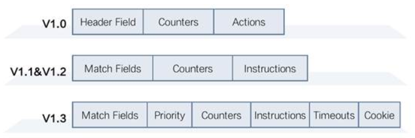
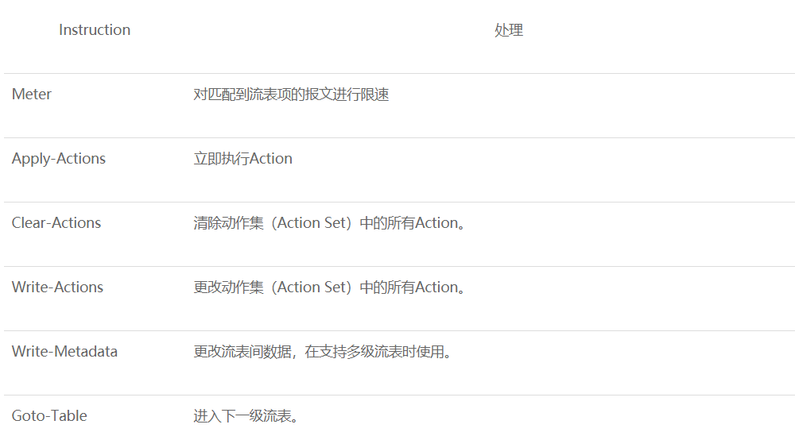
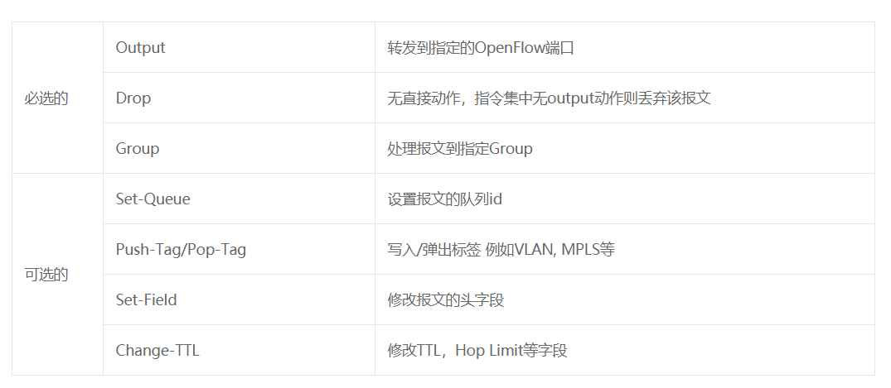
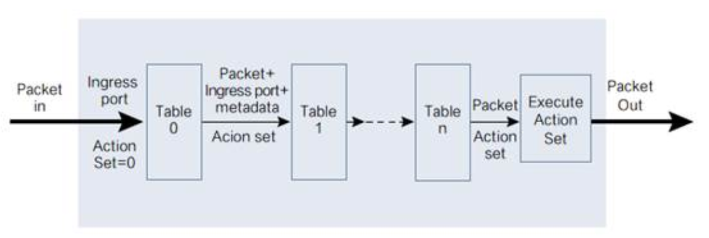
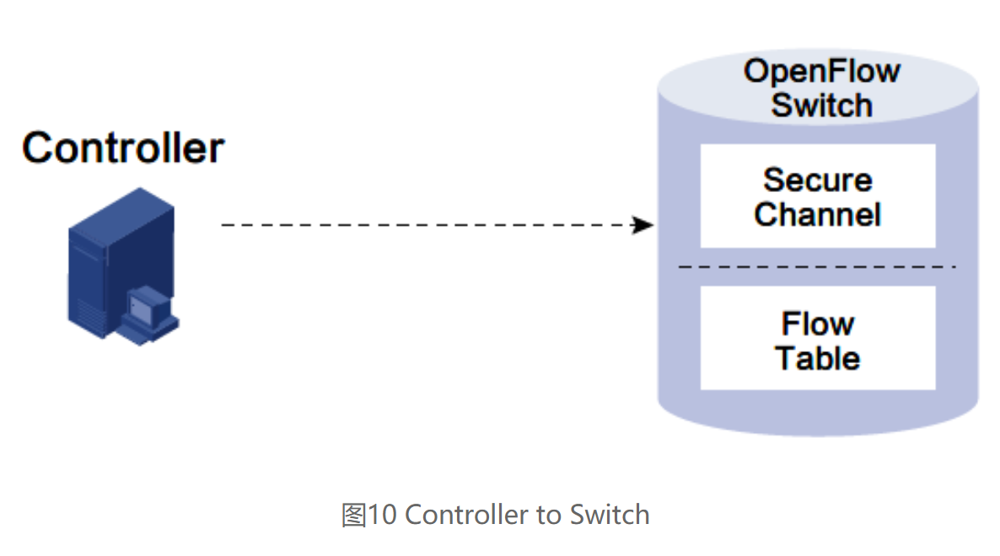
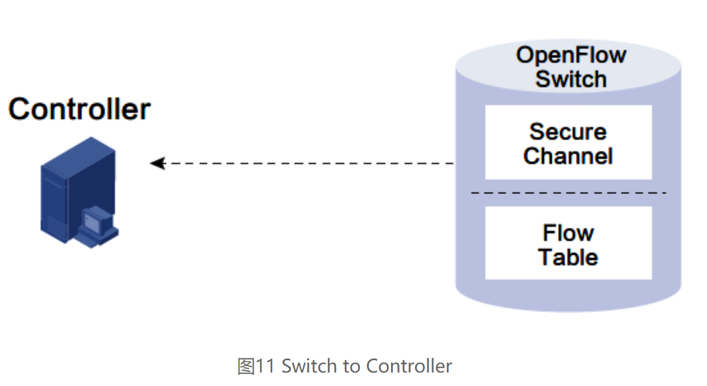
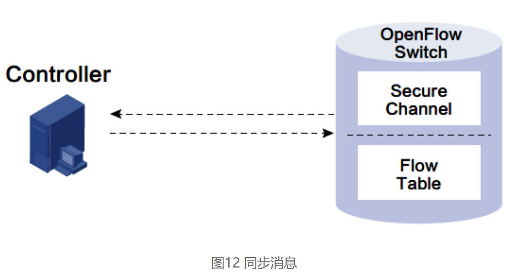
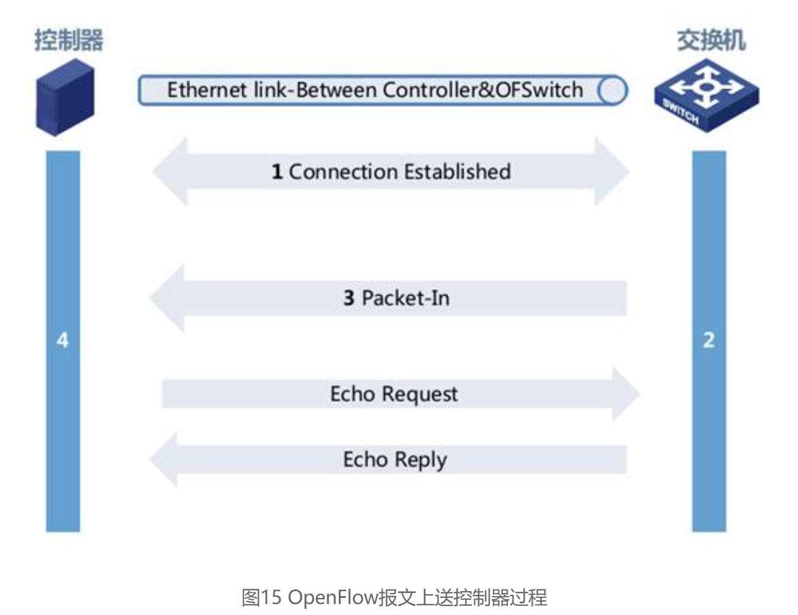
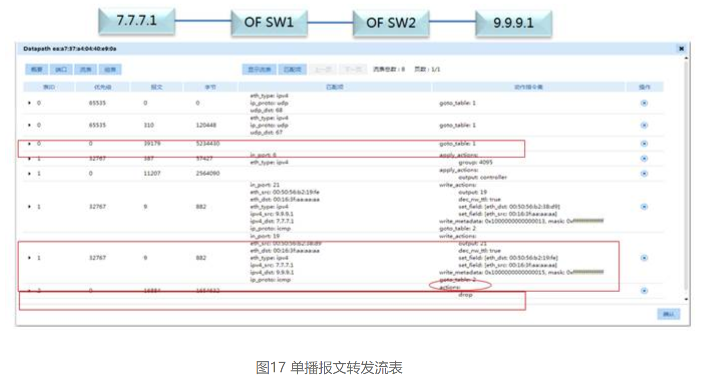

[TOC]

## OpenFlow常用字段

### dl_type

- ip	dl_type=0x800
- ipv6	dl_type=0x86dd
- icmp	dl_type=0x0800,nw_proto=1
- icmp6	dl_type=0x86dd,nw_proto=58
- tcp	dl_type=0x0800,nw_proto=6
- tcp6	dl_type=0x86dd,nw_proto=6
- udp	dl_type=0x0800,nw_proto=17
- udp6	dl_type=0x86dd,nw_proto=17
- sctp	dl_type=0x0800,nw_proto=132
- sctp6	dl_type=0x86dd,nw_proto=132
- arp	dl_type=0x0806
- rarp	dl_type=0x8035
- mpls	dl_type=0x8847
- mplsm	dl_type=0x8848
  

## OpenFlow简介

http://www.h3c.com/cn/d_201811/1131080_30005_0.htm

### 流表项结构

#### Instructions & Actions

常见指令集：

常见的Action动作：

### 流表项处理

处理流程如下：

当报文进入switch后，必须从最小flow table开始依次匹配，flow table可以按次序从小到大越级跳跃，但不能反过来。当处于最后一个流表时，其Action Set中的所有Action将被执行。

每个流表（Flow Table）都包含一个Table Miss流表项，该表项用于定义在流表中没有匹配的报文的处理方式，该表项的匹配域为通配，即匹配任何报文，优先级为0，Instructions与正常表项相同。通常，如果Table-Miss表项不存在，默认行为是丢弃报文。

Flow Entry可以由Controller通过OpenFlow消息进行删除，也可以在Idle Time超时或者Hard Time超时后自动删除。Idle Time超时有两种情况：某个流表表项长时间不匹配报文则idle_timeout字段设置为非0；某个流表表项一定时间过后，无论是否匹配报文 hard_timeout字段设置为非0。如果Controller在建立表项时，携带了Flow Remove标记，则表项在删除时，设备需要通知Controller Flow Remove消息。

### 消息类型

#### Controller to Switch信息

Controller to Switch消息主要包含以下几种类型：

- l Features：用于控制器发送请求来了解交换机的性能，交换机必须回应该报文。
- l Modify-State：用于管理交换机的状态，如流表项和端口状态。该命令主要用于增加、删除、修改OpenFlow交换机内的流表表项，组表表项以及交换机端口的属性
- l Read-State：用于控制器收集交换机各方面的信息，例如当前配置，统计信息等
- l Flow-Mod：Flow-Mod消息用来添加、删除、修改OpenFlow交换机的流表信息。Flow-Mod消息共有五种类型：ADD、DELETE、DELETE-STRICT、MODIFY、MODIFY-STRICT
- l Packet-out：用于通过交换机特定端口发送报文 ，这些报文是通过Packet-in消息接收到的。通常Packet-out消息包含整个之前接收到的Packet-in消息所携带的报文或者buffer ID（用于指示存储在交换机内的特定报文）。这个消息需要包含一个动作列表，当OpenFlow交换机收到该动作列表后会对Packet-out消息所携带的报文执行该动作列表。如果动作列表为空，Packet-out消息所携带的报文将被OpenFlow交换机丢弃。
- l Asynchronous-Configuration：控制器使用该报文设定异步消息过滤器来接收其只希望接收到的异步消息报文，或者向OpenFlow交换机查询该过滤器。该消息通常用于OpenFlow交换机和多个控制器相连的情况。

#### 异步（Asynchronous）消息

由Switch发送给Controller，用来通知Switch上发生的某些异步事件的消息，主要包括Packet-in、Flow-Removed、Port-Status和Error等。例如，当某一条规则因为超时而被删除时，Switch将自动发送一条Flow-Removed消息通知Controller，以方便Controller作出相应的操作，如重新设置相关规则等。

异步消息具体包含以下几种类型：

l Packet-in：转移报文的控制权到控制器。对于所有通过匹配流表项或者Table Miss后转发到Controller端口的报文均要通过Packet-in消息送到Controller。也有部分其他流程（如TTL检查等）也需要通过该消息和Controller交互。Packet-in既可以携带整个需要转移控制权的报文，也可以通过在交换机内部设置报文的Buffer来仅携带报文头以及其Buffer ID传输给Controller。Controller在接收到Packet-in消息后会对其接收到的报文或者报文头和Buffer ID进行处理，并发回Packet-out消息通知OpenFlow交换机如何处理该报文。

l Flow-Removed：通知控制器将某个流表项从流表的移除。通常该消息在控制器发送删除流表项的消息或者流表项的定时器其超时后产生

l Port-Status：通知控制器端口状态或设置的改变

#### 同步（Symmetric）消息

同步（Symmetric）消息是双向对称的消息，主要用来建立连接、检测对方是否在线等，是控制器和OpenFlow交换机都会在无请求情况下发送的消息，包括Hello、Echo和Experimenter三种消息，这里我们介绍应用最常见的前两种：

l Hello：当连接启动时交换机和控制器会发送Hello交互

l Echo：用于验证控制器与交换机之间连接的存活，控制器和OpenFlow交换机都会发送Echo Request/Reply消息。对于接收到的Echo Request消息必须能返回Echo Reply消息。Echo消息也可用于测量控制器与交换机之间链路的延迟和带宽

#### 消息处理

##### 流表下发

OpenFlow流表下发分为主动和被动两种机制：

- 主动模式下，Controller将自己收集的流表信息主动下发给网络设备，随后网络设备可以直接根据流表进行转发
- 被动模式下，网络设备收到一个报文没有匹配的FlowTable记录时，会将该报文转发给Controller，由后者进行决策该如何转发，并下发相应的流表。被动模式的好处是网络设备无需维护全部的流表，只有当实际的流量产生时才向Controller获取流表记录并存储，当老化定时器超时后可以删除相应的流表，因此可以大大节省交换机芯片空间

当OpenFlow交换机和Controller建立连接后，Controller需要主动给OpenFlow交换机下发初始流表，否则进入OpenFlow交换机的报文查找不到流表项，就会做丢弃处理。这里的初始流表保证了OpenFlow的未知报文能够上送控制器。而后续正常业务报文的转发流表，则在实际流量产生时，由主动下发的初始流表将业务报文的首包上送给控制器后，触发控制器以被动模式下发。

##### 报文上送控制器

##### 控制器回应

### 交换机转发

#### 单播报文转发

当OpenFlow交换机接收到Flow-Mod消息，生成流表后，就可以按照流表转发接收到的Packet-out报文了，过程举例如下：

## Faucet的流表

Faucet中一共有8个流表。下面分别介绍。

## 发展

2009年初，发布第一个版本v1.0

2012年，谷歌已经在其全球各地的数据中心骨干网络中大规模地使用OpenFlow/SDN。

我们来看看OpenFlow1.0流表数据包匹配特征的结构：

第一层：交换机入端口，即消息在哪个端口进入交换机（Ingress Port）；

第二层：源MAC地址（Ether source），目的MAC地址（Ether dst），以太网类型（Ether Type），VLAN标签（VLAN id），VLAN优先级（VLAN priority）；

第三层：源IP（IP src），目的IP（IP dst），IP协议字段（IP Proto），IP服务类型（IP Tosbits）；

第四层：TCP/UDP源端口号（TCP/UCP src port），TCP/UDP目的端口号（TCP/UDP dst port）。

