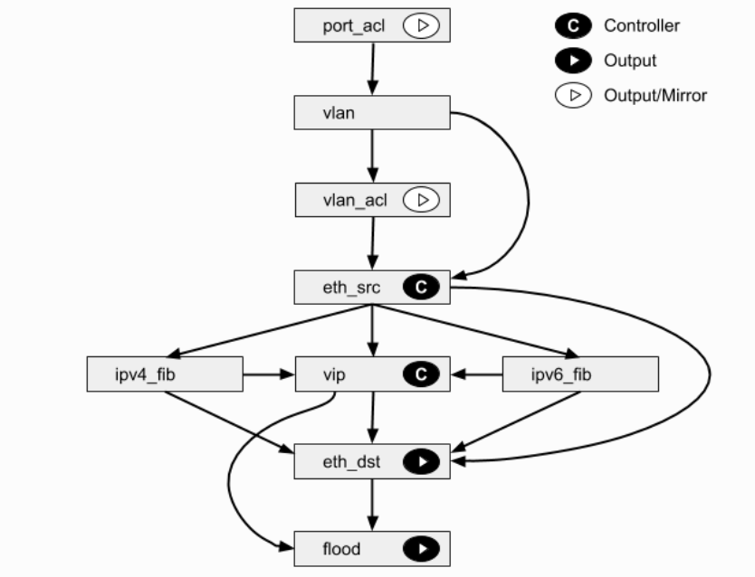

[TOC]


# Github

## Why Open vSwitch?

OVS用于跨主机通信。

### 状态的移动性

Open vSwitch支持在实例之间配置和迁移慢(配置)和快的网络状态。例如，如果VM在终端主机之间迁移，不仅可以迁移相关的配置(SPAN规则、acl、QoS)，还可以迁移任何实时网络状态(例如，包括可能难以重构的现有状态)。

### 响应网络的动态变化

虚拟环境通常具有高变化率的特点。虚拟机来了又走，虚拟机在时间上前后移动，对逻辑网络环境的更改，等等。

Open vSwitch支持许多特性，这些特性允许网络控制系统响应和适应环境的变化。包括简单的会计和可见性支持，如NetFlow、IPFIX和sFlow。但可能更有用的是，Open vSwitch支持网络状态数据库(OVSDB)，OVSDB支持远程触发器。因此，编排软件可以“观察”网络的各个方面，并在它们发生变化时做出响应。

Open vSwitch还支持OpenFlow作为暴露远程访问的方法用以控制流量。这有许多用途，包括通过检查发现或链路状态流量(例如LLDP、CDP、OSPF等)来发现全局网络。

### 逻辑标签的维护

分布式虚拟交换机(如VMware vDS和Cisco的Nexus 1000V)通常通过在网络数据包中添加或操作标签来维护网络中的逻辑上下文。这可以用来唯一地标识VM(以一种防止硬件欺骗的方式)，或者保存一些只与逻辑域相关的其他上下文。构建分布式虚拟交换机的主要问题是有效和正确地管理这些标记。

Open vSwitch包含用于指定和维护标记规则的多个方法，所有这些方法都可以被用于编排工具的远程流程访问。此外，在许多情况下，这些标记规则以优化的形式存储，因此不必与重量级网络设备耦合。例如，这允许配置、更改和迁移数千个标记或地址映射规则。

类似地，Open vSwitch支持能够处理数千个并发GRE通道的GRE实现，并支持用于创建、配置和拆卸隧道的远程配置。例如，这可以用于连接不同数据中心中的私有VM网络。


### 硬件集成

Open vSwitch的转发路径(内核内的数据路径)被设计成可以“卸载”包处理到硬件芯片组，无论是在一个经典的硬件交换机底盘或在一个终端主机NIC。这使得打开的vSwitch控制路径既可以控制纯软件实现，也可以控制硬件交换机。

**有许多正在进行的工作是将Open vSwitch移植到硬件芯片组**。其中包括多个商用硅芯片组(Broadcom和Marvell)，以及一些特定于供应商的平台。文档中的“移植”部分讨论了如何进行这样的移植。硬件集成的优点不仅仅是在虚拟环境中的性能。如果物理交换机也公开了开放的vSwitch控制抽象，那么裸机和虚拟主机环境都可以使用相同的机制来管理自动网络控制。

### 总结

在许多方面，Open vSwitch的目标是设计空间中与以前的hypervisor网络栈不同的一点，重点是在大型基于linux的虚拟化环境中对自动化和动态网络控制的需求。

Open vSwitch的目标是使内核内的代码尽可能小(对于性能来说是必要的)，并在适用时重用现有的子系统(例如Open vSwitch使用现有的QoS堆栈)。从Linux 3.3开始，Open vSwitch就包含在内核中，并且在大多数流行的发行版中都提供了用户空间工具的打包


# Doc

## CentOS OVS安装

下载源码：https://www.openvswitch.org/releases/openvswitch-2.11.1.tar.gz

解压：

```shell
tar zxvf openvswitch-2.11.1.tar.gz
```

生成依赖清单文件：

```shell
cd openvswitch-2.11.1/
sed -e 's/@VERSION@/0.0.1/' rhel/openvswitch-fedora.spec.in > /tmp/ovs.spec
```


 安装相关依赖：

```shell
yum install @'Development Tools' rpm-build yum-utils subscription-manager
```

添加相关repo:

```shell
yum install https://dl.fedoraproject.org/pub/epel/epel-release-latest-7.noarch.rpm
```

安装依赖：

```shell
yum-builddep /tmp/ovs.spec
```

安装：

```shell
./configure
# /configure --prefix=/usr --localstatedir=/var --sysconfdir=/etc
make
make install
```

运行ovsdb-server、ovs-vswitchd：

```shell
export PATH=$PATH:/usr/local/share/openvswitch/scripts
ovs-ctl start
```

测试：

```shell
make check TESTSUITEFLAGS=-j8  # 大约需要几分钟才能完成
```


## Tutorials


### Faucet各个流表的作用

https://docs.faucet.nz/en/latest/architecture.html

```shell
Table 0
Port-based ACLs
Table 1
Ingress VLAN processing
Table 2
VLAN-based ACLs
Table 3
Ingress L2 processing, MAC learning
Table 4
L3 forwarding for IPv4
Table 5
L3 forwarding for IPv6
Table 6
Virtual IP processing, e.g. for router IP addresses implemented by Faucet
Table 7
Egress L2 processing
Table 8
Flooding
```




### Field

每个字段都有下面几个属性：

- Name：字段的名字。由于历史原因，有些字段有两个名字
- Width：字段的宽度 
- Format：十进制、十六进制、以太网、IPv4、IPv6
- Masking：
- Prerequisites
- Access：read/write、read-only


| 字段名 | 长度 | 格式 | Masking | 前置项 | 访问权限 | OpenFlow 1.0 | OpenFlow 1.1 |
| :----: | :--: | :--: | :-----: | :----: | :------: | :----------: | :----------: |
| dl_vlan | 16位 | 十进制 | no | Ethernet |   读/写   |              |              ||
| dl_vlan_pcp | 8位 | 十进制 | no | Ethernet | 读/写 |              |              ||
| vlan_vid | 16位 | 十进制 | 任意按位掩码 | Ethernet | 读/写 | exact match only | exact match only ||
| vlan_pcp | 8位 | 十进制 | no | VLAN VID | 读/写 | exact match only | exact match only ||
| vlan_tci | 16位 | 十六进制 | 任意按位俺码 | Ethernet | 读/写 | exact match only | exact match only ||


|      字段名       | 长度  |   格式   |        Masking         |  前置项   | 访问权限 |   OpenFlow 1.0   |   OpenFlow 1.1   |   NXM/OXM Support    |     描述     |
| :---------------: | :---: | :------: | :--------------------: | :-------: | :------: | :--------------: | :--------------: | :------------------: | :----------: |
|   ip_src/nw_src   | 32位  | IPv4地址 |      按任意位掩码      |   IPv4    |  读/写   | CIDR match only  |       yes        | OF 1.2+ and OVS 1.1+ |  源IPv4地址  |
|   ip_dst/nw_dst   | 32位  | IPv4地址 |      按任意位掩码      |   IPv4    |  读/写   | CIDR match only  |       yes        | OF 1.2+ and OVS 1.1+ | 目的IPv4地址 |
|     ipv6_src      | 128位 | IPv6地址 | 按任意位掩码(OVS 1.8+) |   IPv6    |  读/写   |      不支持      |      不支持      | OF 1.2+ and OVS 1.1+ |  源IPv6地址  |
|     ipv6_dst      | 128位 | IPv6地址 | 按任意位掩码(OVS 1.8+) |   IPv6    |  读/写   |      不支持      |      不支持      | OF 1.2+ and OVS 1.1+ | 目的IPv6地址 |
|    ipv6_label     | 32位  | 十六进制 |      按任意位掩码      |   IPv6    |  读/写   |      不支持      |      不支持      | OF 1.2+ and OVS 1.4+ |              |
| nw_proto/ip_proto |  8位  |  十进制  |         不支持         | IPv4/IPv6 |   只读   | exact match only | exact match only | OF 1.2+ and OVS 1.1+ |              |
|      nw_ttl       |  8位  |  十进制  |         不支持         | IPv4/IPv6 |  读/写   |      不支持      |      不支持      |       OVS 1.4+       | 数据包的TTL  |
|  ip_frag/nw_frag  |  8位  |          |      按任意位掩码      | IPv4/IPv6 |   只读   |      不支持      |      不支持      |       OVS 1.3+       | 和IP分片相关 |
|      nw_tos       |  8位  |  十进制  |         不支持         | IPv4/IPv6 |  读/写   | exact match only | exact match only |       OVS 1.1+       |              |
|      ip_dscp      |  8位  |  十进制  |         不支持         | Pv4/IPv6  |  读/写   | exact match only | exact match only | OF 1.2+ and OVS 1.7+ |              |
|   nw_ecn/ip_ecn   |  8位  |  十进制  |         不支持         | Pv4/IPv6  |  读/写   | exact match only | exact match only | OF 1.2+ and OVS 1.4+ |              |
|                   |       |          |                        |           |          |                  |                  |                      |              |


L4

|     字段名     |        长度        |   格式    |         Masking          | 前置项 | 访问权限 |   OpenFlow 1.0   |   OpenFlow 1.1   |   NXM/OXM Support    |      描述      |
| :------------: | :----------------: | :-------: | :----------------------: | :----: | :------: | :--------------: | :--------------: | :------------------: | :------------: |
| tcp_src/tp_src |        16位        |  十进制   | 按任意位掩码（OVS 1.6+） |  TCP   |  读/写   | exact match only | exact match only | OF 1.2+ and OVS 1.1+ |  源TCP端口号   |
| tcp_dst/tp_dst |        16位        |  十进制   | 按任意位掩码（OVS 1.6+） |  TCP   |  读/写   | exact match only | exact match only | OF 1.2+ and OVS 1.1+ | 目的TCP端口号  |
|   tcp_flags    | 16位(仅使用后12位) | TCP flags |       按任意位掩码       |  TCP   |   只读   |      不支持      |      不支持      | OF 1.3+ and OVS 2.1+ |   TCP flags    |
|    udp_src     |        16位        |  十进制   |       按任意位掩码       |  UDP   |  读/写   | exact match only | exact match only | OF 1.2+ and OVS 1.1+ |  源UDP端口号   |
|    udp_dst     |        16位        |  十进制   |       按任意位掩码       |  UDP   |  读/写   | exact match only | exact match only | OF 1.2+ and OVS 1.1+ | 目的UDP端口号  |
|    sctp_src    |        16位        |  十进制   |       按任意位掩码       |  SCTP  |  读/写   |      不支持      | exact match only | OF 1.2+ and OVS 2.0+ |  源SCTP端口号  |
|    sctp_dst    |        16位        |  十进制   |      按任意位 掩码       |  SCTP  |  读/写   |      不支持      | exact match only | OF 1.2+ and OVS 2.0+ | 目的SCTP端口号 |


| nw_proto/ip_proto | 上层协议 |
| :---------------: | :------: |
|         6         |   TCP    |
|        17         |   UDP    |
|        132        |   SCTP   |

